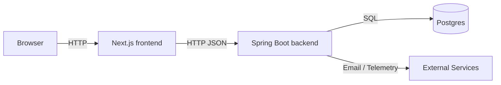

# System Overview

What is it?
- A plain-language summary of the whole application: frontend (Next.js), backend (Spring Boot), the database, and how they fit together.

Why do we need it?
- To give new team members, PMs and QA a single place to understand the big picture before diving into code.

How does it work?
- The frontend handles user interaction and calls backend APIs over HTTP/JSON. The backend processes requests, applies business rules, and reads/writes the database. Migrations keep the schema consistent across environments.

Example (user story)
- User opens the dashboard
- Frontend requests `/api/dashboard`
- Backend controller fetches data from the database and returns JSON
- Frontend renders charts for the user

Files involved
- Frontend: frontend/src/app
- Backend: backend/src/main/java
- Database migrations: backend/src/main/resources/db/migration

Summary
- This document shows where to look when something in the UI doesn't match the data.

Real example (detailed)
1. Browser requests the dashboard page.
2. Next.js code (SSR or client fetch) calls the dashboard API in the frontend client library.
3. Backend controller `DashboardController` receives the HTTP request.
4. Controller calls `DashboardService` which uses repositories to query the DB.
5. Service formats the data to DTOs and returns JSON.
6. Frontend receives JSON and displays charts.

Technical explanation
- Backend follows a layered pattern: Controller → Service → Repository. Repositories map to SQL queries or JPA entities. Database migrations are SQL files applied by Flyway located in `db/migration`.

Simple architecture diagram

Files to open first
- [frontend/src/app](frontend/src/app)
- [backend/src/main/java](backend/src/main/java)
- [backend/src/main/resources/db/migration](backend/src/main/resources/db/migration)

If you're new: run the frontend dev server, open the dashboard, and use the browser network tab to see API calls. Then open the corresponding backend controller to follow the call path.
