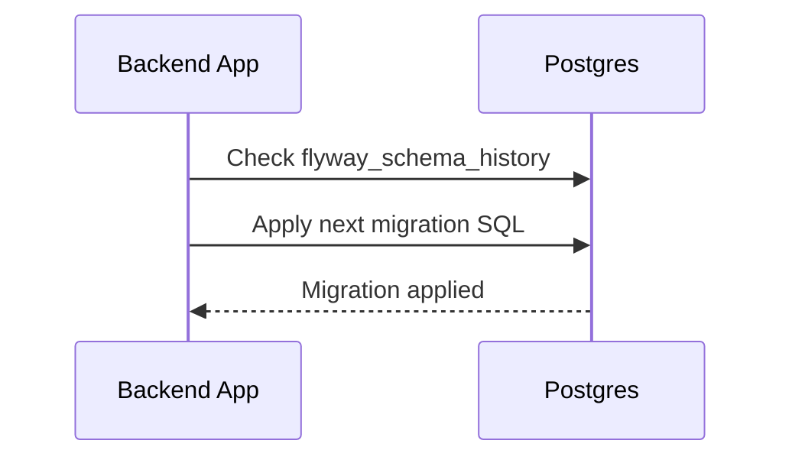

# Database Guide

What is it?
- A beginner-friendly guide to the database schema, important tables, and how migrations work.

Why do we need it?
- To help developers and QA understand where data lives, how to read example records, and how to safely change schema.

How does it work?
- The project uses SQL migrations in `backend/src/main/resources/db/migration`. Each file (V{n}__description.sql) is applied in order by Flyway when the app starts. Repository classes or SQL queries read and write data.

Example Record and table explanation
- Table `fleet` (example):
  - Simple explanation: holds information about vehicles.
  - Example record: `{ id: 42, name: "Truck 42", status: "active", location: "Depot A" }`
  - Relationships: `fleet` may link to `equipment` (one-to-many). Business meaning: a fleet item is a real-world vehicle under management.

When to edit schema
- Add a migration file when you need a new column or table. Do NOT edit old migration files once shared — create a new migration that alters schema safely.

How to run migrations locally
1. Start the local Postgres service (or container).
2. Build and run the backend with Maven — Flyway runs on startup and applies migrations.

Typical files involved
- Migration scripts: backend/src/main/resources/db/migration
- DB config: backend/src/main/resources/application.properties
- Repositories: backend/src/main/java/**/repository

Technical explanation
- Flyway orders files by version prefix (V1__, V2__, ...). Each migration is committed as SQL. The app stores a `flyway_schema_history` table to track applied migrations.

Simple diagram

If you're changing data models: write a migration that includes both schema change and data backfill if needed, test on a copy of production data, and coordinate with the team.
