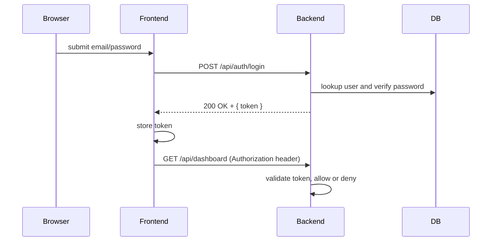

# Authentication Flow

What is it?
- A clear description of how user authentication works: login, token issuance, and how the frontend stores and sends credentials.

Why do we need it?
- So PMs, QA and new engineers understand how users prove who they are and where to look when login fails or permissions look wrong.

How does it work?
- Basic flow: user submits email/password → backend validates credentials → backend issues a JWT → frontend stores the JWT and sends it on subsequent API requests.

Example (step-by-step)
- User clicks Login
- Frontend sends POST `/api/auth/login` with `{ email, password }`
- Backend checks the password (hashed) against the database
- If valid, the backend creates a JWT (signed token) and returns it
- Frontend stores the token in memory or secure cookie and adds `Authorization: Bearer <token>` to API requests

Why JWT? Simple explanation
- JWT (JSON Web Token) is a signed token that tells the backend who the user is. Example: the token contains `{ userId: 42, roles: ["admin"] }` and a signature so the backend can trust it.

Files involved
- Frontend login page: [frontend/src/app/auth/login/page.tsx](frontend/src/app/auth/login/page.tsx)
- Frontend auth client: [frontend/src/lib/api/auth.ts](frontend/src/lib/api/auth.ts)
- Backend controller (login endpoints): [backend/src/main/java/com/stratumiq/backend/modules/auth/AuthController.java](backend/src/main/java/com/stratumiq/backend/modules/auth/AuthController.java)
- Backend token logic (JWT utilities): [backend/src/main/java/com/stratumiq/backend/security/JwtUtil.java](backend/src/main/java/com/stratumiq/backend/security/JwtUtil.java#L14)
- Request filter that validates Bearer tokens: [backend/src/main/java/com/stratumiq/backend/security/JwtAuthFilter.java](backend/src/main/java/com/stratumiq/backend/security/JwtAuthFilter.java#L22)
- Config/keys: [backend/src/main/resources/application.properties](backend/src/main/resources/application.properties#L21) and [backend/.env](backend/.env#L3)

Security notes (plain English)
- Never store raw passwords — they are hashed and salted using a proven library.
- Prefer HttpOnly cookies for tokens if you need to prevent XSS token theft; localStorage is simpler but less secure.

Technical explanation
- On the backend the JWT is signed with a secret key or private key. The backend middleware (filter) validates the signature and populates a security context for the request.

Simple sequence diagram

If you're QA: test invalid passwords, expired tokens, and role-based access (try calling protected endpoints without a token).
