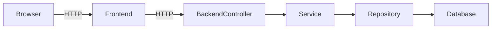

# API Reference (Readable Summary)

What is it?
- A friendly, example-first index of the most important backend endpoints frontends and QA will use.

Why do we need it?
- So PMs, QA and engineers know which endpoints exist, what they expect, and example requests/responses.

How does it work?
- Each entry shows: endpoint path, method, purpose, example request body, example response, and who owns it.

Example endpoints
- `GET /api/dashboard`
  - Purpose: return a user's dashboard data
  - Example request: `GET /api/dashboard?from=2026-01-01&to=2026-01-31`
  - Example response: `{ summary: { activeFleet: 12, alerts: 3 }, charts: [...] }`

- `POST /api/auth/login`
  - Purpose: user login
  - Request: `{ email, password }`
  - Response: `{ token: "..." }`

How to add an API here
- When adding a new controller endpoint, add a short entry: path, method, purpose, example request and example response. Keep examples small and realistic.

Files involved
- Backend controllers: backend/src/main/java/**/controller
- Frontend clients: frontend/src/lib/api

Technical explanation
- Backend controllers map HTTP verbs and paths to Java methods (Spring `@RestController`). They accept DTOs and return DTOs. Validation happens on input DTOs and exceptions map to HTTP error codes.

Quick diagram: request lifecycle

If you're writing tests: mock the service layer and assert the controller returns expected HTTP codes for success and failure.
