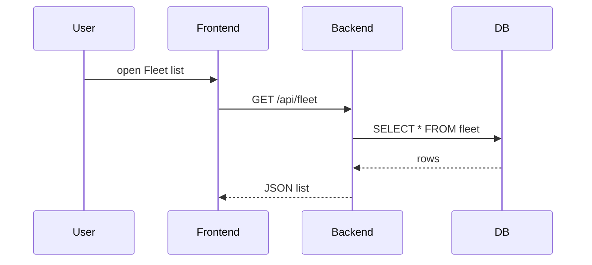

# Fleet Module

What is it?
- Documentation for the `fleet` feature: what it does, why it exists, how data is structured, and how the UI and backend connect.

Why do we need it?
- To explain the business meaning of the fleet, what files to change when adding fields, and what tests to write for QA.

How does it work?
- The fleet module lets users view and manage vehicles and their status. The frontend shows lists and detail pages. Backend controllers provide CRUD APIs. The database stores fleet records.

Files involved
- Frontend pages: [frontend/src/app/dashboard/fleet](frontend/src/app/dashboard/fleet)
- Frontend client: [frontend/src/lib/api/fleet.ts](frontend/src/lib/api/fleet.ts)
- Backend controller/service/repository: [backend/src/main/java/com/stratumiq/backend/modules/fleet/FleetController.java](backend/src/main/java/com/stratumiq/backend/modules/fleet/FleetController.java#L17) and related service/repository classes
- DB table: `fleet` in [backend/src/main/resources/db/migration](backend/src/main/resources/db/migration)

Data involved (simple table):
- `fleet` table columns: `id`, `name`, `status`, `last_seen`, `location_id`
- Example record: `{ id: 100, name: "Truck 100", status: "in_service", last_seen: "2026-06-01T10:00Z" }`

Typical user action (example)
1. User opens Fleet list page.
2. Frontend calls `GET /api/fleet`.
3. Backend returns a list of fleets.
4. User clicks a fleet item to open detail page → frontend calls `GET /api/fleet/{id}`.

Technical explanation
- Backend provides REST endpoints for list, get, create, update, delete. Services enforce business rules (e.g., prevent deleting a fleet with active alerts). Repositories run SQL or JPA queries.

Simple sequence diagram

Testing tips (QA)
- Verify list filters (status), pagination, create/update flows, and permission checks (who can edit/delete).
