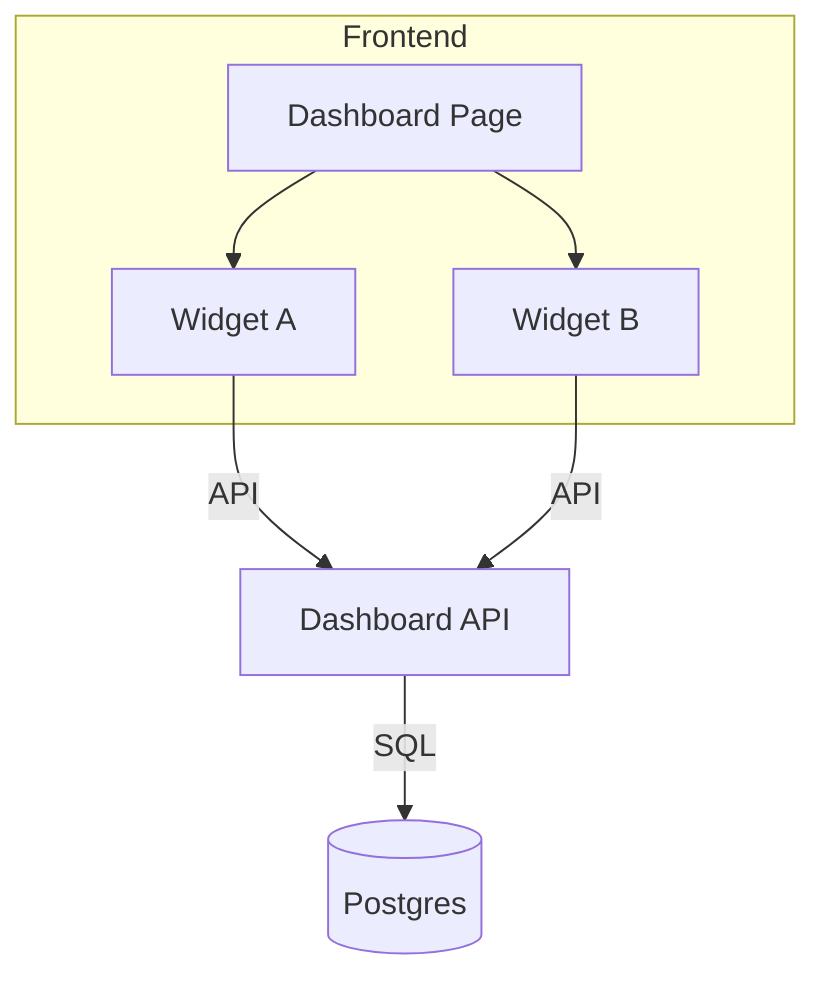

# Dashboard Module

What is it?
- Explains the dashboard pages: what data they show, how the widgets are built, and where to change them.

Why do we need it?
- The dashboard is central to the product experience. This doc helps PMs decide what to add and helps developers know where to make changes.

How does it work?
- Dashboard widgets are composed in the frontend from small components. Data comes from `/api/dashboard` which aggregates several services (fleet, alerts, maintenance).

Files involved
- Frontend: [frontend/src/app/dashboard](frontend/src/app/dashboard) and [frontend/src/components/dashboard](frontend/src/components/dashboard)
- Frontend API client: [frontend/src/lib/api/dashboard.ts](frontend/src/lib/api/dashboard.ts)
- Backend controller/service: [backend/src/main/java/com/stratumiq/backend/modules/dashboard/DashboardController.java](backend/src/main/java/com/stratumiq/backend/modules/dashboard/DashboardController.java#L15) and `DashboardService`

Example widget flow
1. Widget component mounts in React.
2. Component calls `useEffect` to fetch a specific endpoint.
3. API returns data shaped for the widget.
4. Component renders chart or table.

Real example
- Widget: Active Fleet Count
  - Frontend component: `ActiveFleetWidget.tsx`
  - Backend provides `GET /api/dashboard/active-fleet` returning `{ count: 12 }`

Technical explanation
- In order to keep performance good, the backend aggregates data in one endpoint for the whole dashboard (to reduce round trips) while some widgets can lazily load extra details.

Diagram

If you add a widget: add a frontend component, add an API to backend (or reuse an existing aggregated field), and add tests to ensure the new data is returned correctly.
