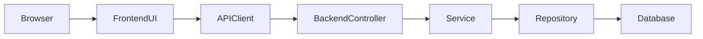

# Code Flow Guide

What is it?
- A practical guide to follow a user action from frontend click to database change — the exact files and functions to inspect.

Why do we need it?
- Helps new developers and QA trace behavior and fix bugs faster by following a predictable path through the code.

How does it work?
- We show a simple example: user edits a fleet item's name. For each step we list the frontend file, backend controller method, service call, repository query, and migration (if schema change required).

Example flow: Edit Fleet Name
1. Frontend page: `frontend/src/app/dashboard/fleet/[id]/page.tsx` - form submit handler calls `PUT /api/fleet/{id}`.
2. Frontend API client: `frontend/src/lib/api/fleet.ts` - builds request.
3. Backend controller: `FleetController.updateFleet(id, dto)` - validates DTO.
4. FleetService: `updateFleet` - applies business rules and calls repository.
5. FleetRepository: `update name` SQL or JPA save.
6. DB: `fleet` row updated.

Files involved
- Frontend form: `frontend/.../fleet` files
- Backend controller/service/repository: `backend/src/main/java/.../fleet`

Technical explanation
- Follow the request path: Browser → Frontend handler → API client → Backend controller → Service → Repository → Database.

Debugging tips
- Use browser devtools to inspect request body and response codes.
- Add logs in the controller and service to inspect inputs.
- Use `pgcli` or `psql` to inspect the database row to confirm the change.

Simple flowchart

If a bug spans frontend and backend: capture a replay (network tab + sample request/response), then step through the files above.
