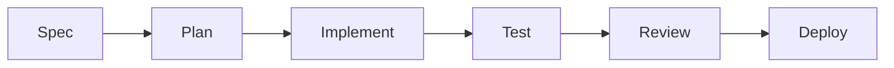

# How To Add New Features (Beginner Friendly)

What is it?
- A practical recipe for taking a product idea from request to deployed feature: planning, code changes, tests, and release steps.

Why do we need it?
- So junior devs and PMs understand the steps and artifacts required to ship a new capability safely.

How does it work? (high level)
- Steps: design → plan → implement → test → review → deploy.

Detailed steps with examples
1. Design: write a short spec (1 page) that includes user story, success criteria, and example UI mock or wireframe.
   - Example: "Add search to Fleet list" — success: users can filter fleets by name and status.
2. Plan: identify backend API changes, database changes, and frontend components to add.
   - Files: controllers, services, repositories, frontend components, migrations.
3. Implement: make small commits that are easy to review. Use feature branches and a meaningful PR title.
   - Example commit flow: `feat(fleet): add search endpoint` → `feat(fleet): add frontend search box`.
4. Test: write unit tests for backend logic and component tests for frontend. Manual QA: run through the success criteria.
5. Review: open a PR, request review from a backend and a frontend engineer. Address comments and add small demos/screenshots.
6. Deploy: follow the project's deployment checklist (run migrations first, deploy backend, then frontend if required).

Files involved
- API: backend controllers and services
- UI: frontend components under `frontend/src/app/dashboard/fleet`
- DB: `backend/src/main/resources/db/migration`

Technical explanation
- Keep changes incremental and deployable. If a database change is required, write a migration plus a backwards-compatible code change so the new code and old code can work during a rolling deployment.

Simple flowchart

Example: add a new filter to fleet list
- Design: UI with a status dropdown.
- Plan: add `status` query param to `GET /api/fleet` (no schema change).
- Implement: backend parse param, adjust repository query; frontend add dropdown and client param.
- Test: unit tests for query parsing, e2e test or manual test to confirm filtered results.

If you're new: try a small feature (label change or simple API filter) to learn the end-to-end flow before attempting migrations or complex data changes.
